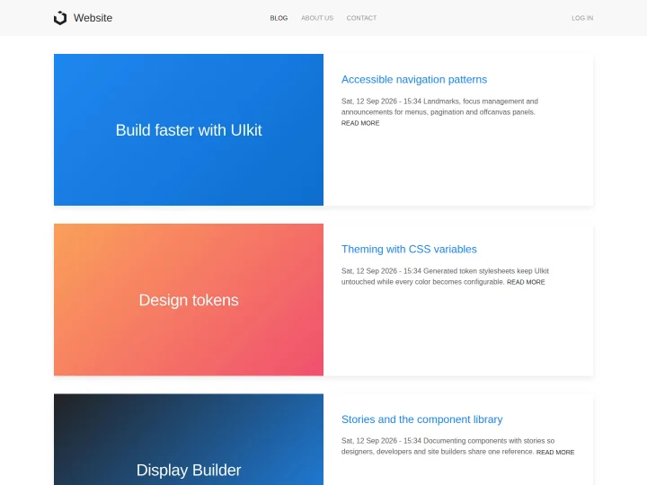

# Website Starter

A Drupal site template for company and product websites, built with
[Display Builder](https://www.drupal.org/project/display_builder) and the
[UI Suite UIkit](https://www.drupal.org/project/ui_suite_uikit) design system. Pages, blog listings and blog
posts are made of UIkit components arranged in Display Builder — no Canvas, no Layout Builder displays.



## Install with Composer

Start a new project with the [Website](https://www.drupal.org/project/website) project template, which
installs this site template:

```shell
composer create-project drupal/website my_site
cd my_site
```

Or add the site template to an existing Drupal 11.4 project, for example a Drupal CMS project:

```shell
composer require drupal/website_starter
drush site:install recipes/website_starter
```

On an already installed site, apply it as a recipe:

```shell
drush recipe recipes/website_starter
```

## Local setup with DDEV

```shell
ddev config --project-type=drupal11 --docroot=web
ddev start
ddev composer require drupal/website_starter
ddev drush site:install recipes/website_starter -y
ddev launch
```

## What you get

- **Content types**: Webpage and Web Blog, with the media library (images, documents, audio, video) of Web
  Assets.
- **A page layout** built in Display Builder with UIkit components: sticky navbar with logo, main and account
  menus, offcanvas menu on small screens, content section and footer with menus, social links and copyright.
- **Content displays** built in Display Builder: blog posts as UIkit articles, blog teasers as UIkit cards, a
  paginated front page listing.
- **Contact webform** with anti-spam protection.
- **Administration**: Gin with its toolbar, Coffee, Project Browser and automatic updates, without Navigation
  and Dashboard (they require Layout Builder); authentication, anti-spam and basic SEO recipes of Drupal CMS;
  editor, SEO, security and configuration management features of Webship.
- **Design system**: the UI Suite UIkit theme with its UI Styles utilities, UI Skins design tokens (light and
  dark color modes) and UI Icons pack.
- **UIkit showcase**: the common pages of the free UIkit demos, in a *UIkit showcase* menu: a landing page,
  Features, Get started, Gallery (masonry grid and lightbox), Slideshows and Elements, with Support and Image
  credits pages in the footer. The images are the UIkit demo images (MIT) and NASA public domain photos.
- **Demo content**: About us, Privacy and Terms pages, 32 illustrated blog posts, a video, menus and footer
  links — imported as Drupal default content.

## Requirements

- Drupal 11.4 or later.
- PHP 8.3 or later.
- Composer 2.

## Tests

Automated functional tests use [webship-js](https://www.npmjs.com/package/webship-js) against a site
installed from this recipe:

```shell
npm install
LAUNCH_URL=https://my-site.ddev.site npm test
```

## Learn more

- [Display Builder documentation](https://project.pages.drupalcode.org/display_builder)
- [UI Suite UIkit components](https://www.drupal.org/project/ui_suite_uikit)
- [Drupal recipes](https://www.drupal.org/docs/extending-drupal/drupal-recipes)

## Maintainers

- Rajab Natshah: [RajabNatshah](https://www.drupal.org/u/rajabnatshah)
